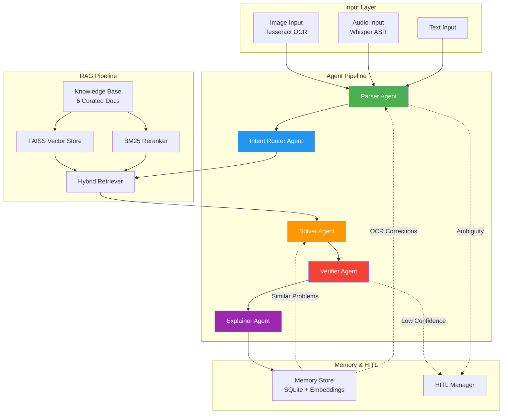

# Math Mentor — Multimodal Math Problem Solver

An end-to-end AI application that reliably solves JEE-style math problems, explains solutions step-by-step, and improves over time.

Built with **RAG + Multi-Agent System + HITL + Memory & Self-Learning**.

## Architecture



## Features

- **Multimodal Input**: Image (OCR), Audio (ASR), Text
- **5 Specialized Agents**: Parser, Intent Router, Solver, Verifier, Explainer
- **RAG Pipeline**: FAISS + BM25 hybrid retrieval over curated math knowledge base
- **HITL**: Human-in-the-loop for OCR/ASR corrections and solution validation
- **Memory & Self-Learning**: SQLite-backed memory with embedding similarity search
- **Config-Driven**: Everything controlled via `config/config.yaml`

## Setup

### Prerequisites
- Python 3.9+
- Tesseract OCR installed (`brew install tesseract` on macOS)
- Google API key for Gemini

### Installation

```bash
# Clone the repository
cd AI_Planet

# Create and activate virtual environment
python3 -m venv venv
source venv/bin/activate

# Install dependencies
pip install -r requirements.txt

# Copy and configure environment variables
cp .env.example .env
# Edit .env and add your GOOGLE_API_KEY
```

### Running

```bash
# Start the server
uvicorn app.main:app --reload --host 0.0.0.0 --port 8000
```

The API will be available at `http://localhost:8000`.
Interactive docs at `http://localhost:8000/docs`.

## API Endpoints

| Method | Endpoint | Description |
|--------|----------|-------------|
| POST | `/api/solve` | Solve a math problem (text/image/audio) |
| GET | `/api/hitl/pending` | List pending HITL reviews |
| POST | `/api/hitl/review` | Submit HITL review (approve/reject/correct) |
| GET | `/api/hitl/{session_id}` | Get HITL status for a session |
| GET | `/api/memory/similar?query=...` | Find similar past problems |
| POST | `/api/memory/feedback` | Submit feedback on a solution |
| GET | `/api/memory/stats` | Get memory store statistics |
| GET | `/health` | Health check |

## Example Usage

### Solve a text problem
```bash
curl -X POST http://localhost:8000/api/solve \
  -H "Content-Type: application/json" \
  -d '{
    "input_mode": "text",
    "text": "Solve x^2 - 5x + 6 = 0"
  }'
```

### Solve from an image
```bash
# base64 encode your image first
IMAGE_B64=$(base64 -i math_problem.png)
curl -X POST http://localhost:8000/api/solve \
  -H "Content-Type: application/json" \
  -d "{
    \"input_mode\": \"image\",
    \"image_base64\": \"$IMAGE_B64\"
  }"
```

### Submit HITL feedback
```bash
curl -X POST http://localhost:8000/api/hitl/review \
  -H "Content-Type: application/json" \
  -d '{
    "session_id": "YOUR_SESSION_ID",
    "action": "correct",
    "corrected_text": "Solve x² - 5x + 6 = 0",
    "feedback": "OCR missed the superscript"
  }'
```

## Project Structure

```
AI_Planet/
├── config/
│   ├── config.yaml              # Main config (all settings & agent prompts)
│   └── knowledge_base/          # Curated math reference documents
├── app/
│   ├── main.py                  # FastAPI entry point
│   ├── config.py                # Config loader (YAML + env vars)
│   ├── models/                  # Pydantic schemas & enums
│   ├── routers/                 # API routes (solve, hitl, memory)
│   ├── services/
│   │   ├── input_handlers/      # Image (OCR), Audio (ASR), Text
│   │   ├── agents/              # 5 LLM agents
│   │   ├── rag/                 # Knowledge loader, FAISS, BM25
│   │   ├── hitl/                # HITL queue & review
│   │   ├── memory/              # SQLite memory store
│   │   └── pipeline.py          # Pipeline orchestrator
│   └── utils/                   # Math tools, logger
├── data/                        # Runtime data (vector store, memory DB)
├── .env.example
├── requirements.txt
└── README.md
```

## Math Topics Covered
- **Algebra**: Quadratic equations, inequalities, sequences, logarithms, binomial theorem
- **Probability**: Bayes' theorem, distributions, combinatorics, expected value
- **Calculus**: Limits, derivatives, integrals, optimization
- **Linear Algebra**: Matrices, determinants, eigenvalues, systems of equations

## Environment Variables

| Variable | Description | Required |
|----------|-------------|----------|
| `GOOGLE_API_KEY` | Google Gemini API key | Yes |
| `CONFIG_PATH` | Path to config.yaml | No (default: `config/config.yaml`) |
| `LLM_MODEL` | Override LLM model | No |
| `SERVER_PORT` | Override server port | No |
